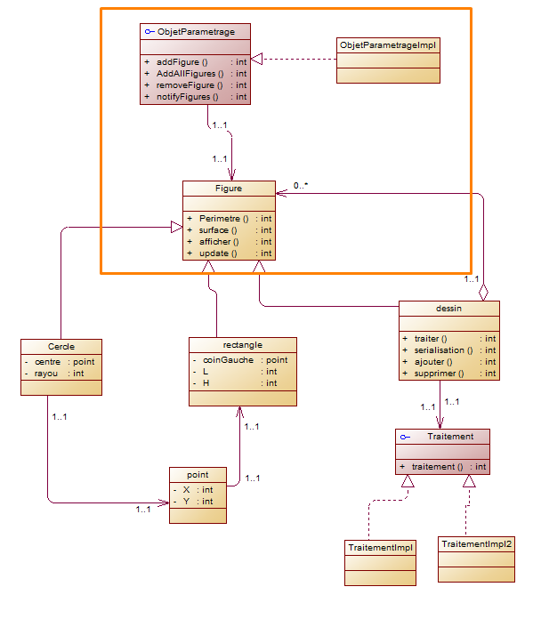
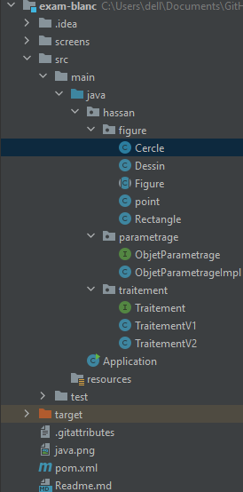

## <span style="color: red"> diagramme de classe de toute l'application</span>


## <span style="color: red"> pour le figure rectangle,circle et Dessin j'ai utilise le pattern Composite</span>


## <span style="color: red"> Pour la methode de traitement j'ai utilise le pattern strategy</span>


## <span style="color: red"> Pour l'objet de parametrage et le figure j'ai utilise le pattern observer</span>



## <span style="color: red"> Pour l'objet de parametrage et le figure j'ai utilise le pattern observer</span>


## Cercle

```java
package hassan.figure;

import hassan.traitement.Traitement;

public class Cercle extends Figure{

    private point centre =new point();
    private double rayon=2 ;
    private Traitement traitement ;


    public Cercle(int x, int y, double rayon) {
        this.centre = new point(x,y);
        this.rayon = rayon;
    }

    public Cercle() {

    }
    @Override
    public double perimetre() {
        return rayon;
    }

    @Override
    public double surface() {
        return 2*3.14*rayon;
    }

    @Override
    public void dessigner() {

    }


    @Override
    public void afficher() {
        System.out.println("------------------");
        System.out.println("le figure est une circle de rayon "+rayon+"du centre X "+centre.X+" Y "+centre.Y);
        System.out.println("le perimetre est : "+ perimetre());
        System.out.println("la surface  est : "+ surface());

    }
}


```
# Rectangle

```java
package hassan.figure;

public class Rectangle extends Figure{

    private point coinGauche =new point();

    private double L ;
    private double H ;

    public Rectangle(point coinGauche, double l, double h) {
        this.coinGauche = coinGauche;
        L = l;
        H = h;
    }
    public Rectangle() {

    }


    public point getCoinGauche() {
        return coinGauche;
    }

    public void setCoinGauche(point coinGauche) {
        this.coinGauche = coinGauche;
    }

    public double getL() {
        return L;
    }

    public void setL(double l) {
        L = l;
    }

    public double getH() {
        return H;
    }

    public void setH(double h) {
        H = h;
    }

    @Override
    public double perimetre() {
        return L*H;
    }

    @Override
    public double surface() {
        return 2*(L+H);
    }

    @Override
    public void dessigner() {

    }


    @Override
    public void afficher() {
        System.out.println("------------------");
        System.out.println("le figure est un rectangle de Longuer "+L+" du hauteur "+H);
        System.out.println("le perimetre est :"+ perimetre());
        System.out.println("la surface  est :"+ surface());

    }


}


```

## Dessin

```java
package hassan.figure;

import hassan.traitement.Traitement;

import java.util.ArrayList;
import java.util.List;

public class Dessin extends Figure{

    List<Figure> figures = new ArrayList<>();
    private Traitement traitement ;

    public Dessin(List<Figure> figures) {
        this.figures = figures;
    }
    public Dessin() {

    }
    public List<Figure> getFigures() {
        return figures;
    }

    public void setFigures(List<Figure> figures) {
        this.figures = figures;
    }


    @Override
    public double perimetre() {
        return 0;
    }

    @Override
    public double surface() {
        return 0;
    }

    @Override
    public void dessigner() {

    }

    public Dessin(List<Figure> figures, Traitement traitement) {
        this.figures = figures;
        this.traitement = traitement;
    }

    public Traitement getTraitement() {
        return traitement;
    }

    public void setTraitement(Traitement traitement) {
        this.traitement = traitement;
    }

    public void ajouterDessin(Figure figure){
        figures.add(figure);
    }
    public void SupprimerDessin(Figure figure){
        figures.remove(figure);
    }
    public void serialisation () {
        System.out.println("serialisation du dessin");
    }
    public void traiter() {
        traitement.traiter();
    }

    @Override
    public void afficher() {
        System.out.println("-------------Le dessin -------------");
        for (int i = 0; i < figures.size(); i++) {
            figures.get(i).afficher();
        }
    }
}

```
## Point
```java
package hassan.figure;

public class point {
    int X ;
    int Y ;

    public point(int x, int y) {
        X = x;
        Y = y;
    }

    public point() {

    }
}


```
## Traitement 
```java

package hassan.traitement;

public interface Traitement {
    void traiter();
}

```
# Traitement version 1

```java
package hassan.traitement;

import hassan.traitement.Traitement;

public class TraitementV1 implements Traitement {
    @Override
    public void traiter() {
        System.out.println("traitement par la version 1");
    }
}


```
## Traitement version 2

```java
package hassan.traitement;

import hassan.traitement.Traitement;

public class TraitementV2 implements Traitement {
    @Override
    public void traiter() {
        System.out.println("hassan.traitement.Traitement");
    }
}

```
## Test
```java

import hassan.figure.Cercle;
import hassan.figure.Dessin;
import hassan.figure.Rectangle;
import hassan.figure.point;
import hassan.parametrage.ObjetParametrageImpl;
import hassan.traitement.Traitement;
import hassan.traitement.TraitementV1;

public class Application {

    public static void main(String[] args) throws ClassNotFoundException, InstantiationException, IllegalAccessException {

        Dessin dessin = new Dessin();


        Cercle cercle = new Cercle(1,2,3);
        Cercle cercle1 = new Cercle(2,3,4);
        Rectangle rectangle = new Rectangle(new point(5,2),2,1);
        dessin.ajouterDessin(cercle);
        dessin.ajouterDessin(cercle1);
        dessin.ajouterDessin(rectangle);
        dessin.afficher();


        ObjetParametrageImpl objetParametrage = new ObjetParametrageImpl() ;
        objetParametrage.addAllFigures(dessin.getFigures());
        objetParametrage.setCouleurRemp(25);


        Dessin dessin2 = new Dessin();
        dessin2.ajouterDessin(new Cercle(2,5,5));
        dessin2.ajouterDessin(new Rectangle(new point(2,2),5,4));


        dessin.ajouterDessin(dessin2);

        Traitement traitement = new TraitementV1();
        dessin.setTraitement(traitement);
        dessin.traiter();


        dessin.afficher();


    }
}

```

