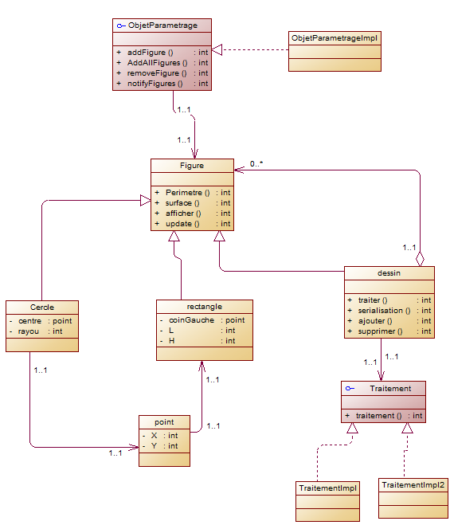
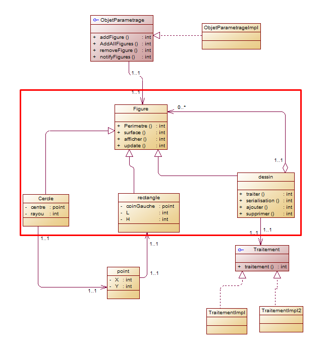
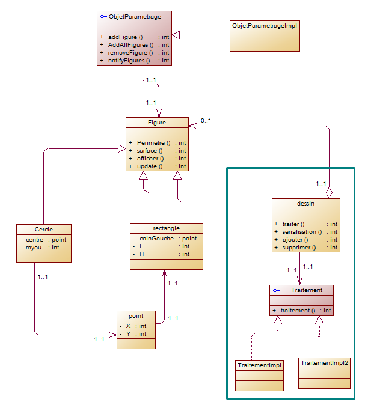

##  diagramme de classe de toute l'application

##  pour le figure rectangle,circle et Dessin j'ai utilise le pattern Composite

##  Pour la methode de traitement j'ai utilise le pattern strategy

##  Pour l'objet de parametrage et le figure j'ai utilise le pattern observer

